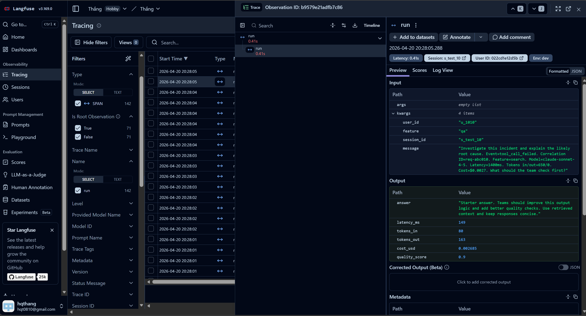
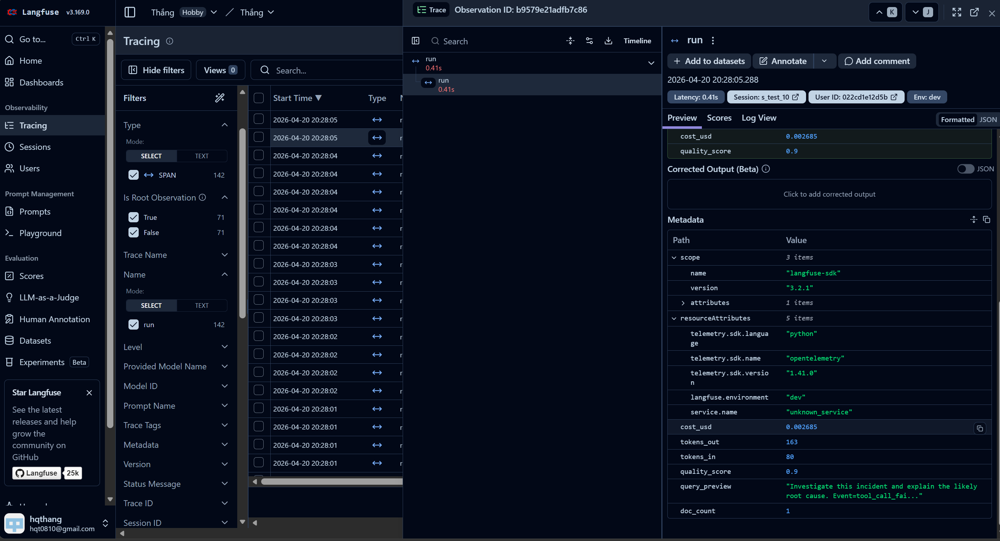
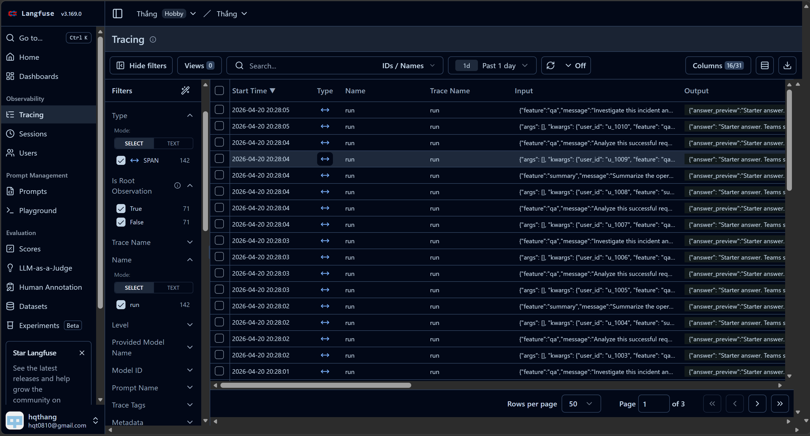
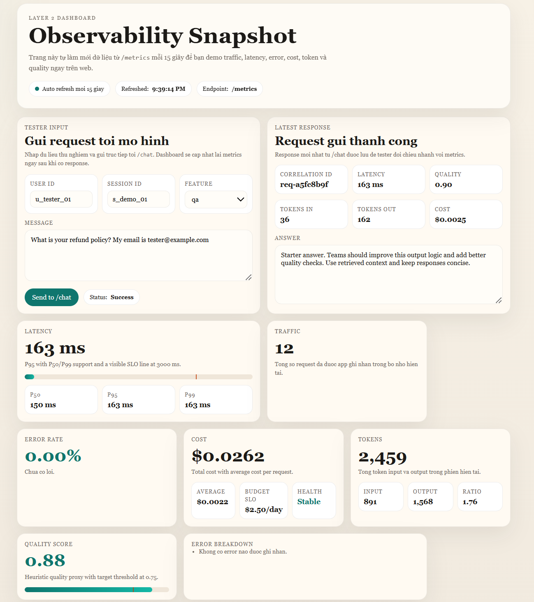

# Day 13 Observability Lab Report

> **Instruction**: Fill in all sections below. This report is designed to be parsed by an automated grading assistant. Ensure all tags (e.g., `[GROUP_NAME]`) are preserved.

## 1. Team Metadata
- GROUP_NAME: X03_C401
- REPO_URL: https://github.com/huanvu05/Lab13-Observability
- MEMBERS: task-individual.md
  - Member A: Vũ Văn Huân | Role: Logging & Middleware
  - Member B: Hoàng Quang Thắng | Role: Tracing + Metrics + Dashboard


---

## 2. Group Performance (Auto-Verified)
- VALIDATE_LOGS_FINAL_SCORE: 100/100
- TOTAL_TRACES_COUNT: 431 (Unique correlation IDs found)
- PII_LEAKS_FOUND: 0

---

## 3. Technical Evidence (Group)

### 3.1 Logging & Tracing
- [EVIDENCE_CORRELATION_ID_SCREENSHOT]: 
  ```json
  {"service": "api", "payload": {"message_preview": "Summarize the operational risk in this warning event. Event=slow_response. Corre..."}, "event": "request_received", "feature": "summary", "session_id": "s_test_04", "correlation_id": "req-22eb530e", "user_id_hash": "836f8aa11658", "env": "dev", "model": "claude-sonnet-4-5", "level": "info", "ts": "2026-04-20T10:42:47.959242Z"} 
  ```
- [EVIDENCE_PII_REDACTION_SCREENSHOT]: 
  ```json
  {"service": "api", "payload": {"message_preview": "What is your refund policy? My email is [REDACTED_EMAIL]"}, "event": "request_received", "feature": "qa", "session_id": "s_demo_01", "correlation_id": "req-0604efe8", "user_id_hash": "91dfa2dfe29b", "env": "dev", "model": "claude-sonnet-4-5", "level": "info", "ts": "2026-04-20T10:43:48.115657Z"}
  ```
- [EVIDENCE_TRACE_WATERFALL_SCREENSHOT]: 
  - 
  - 
  - 
  - [Link to Langfuse Traces](https://us.cloud.langfuse.com/project/cmo6x4apz002iad0776k020ww/traces)
- [TRACE_WATERFALL_EXPLANATION]: Trace cho session "s_test_10" phân tích một sự cố. Waterfall theo dõi chính xác độ trễ 0,41 giây, 80 input tokens và 163 output tokens. Trace_link hiệu quả với metadata như quality_score (0.9) và computed_cost ($0,002685), cùng với user_id và session identifiers.

### 3.2 Dashboard & SLOs
- [DASHBOARD_6_PANELS_SCREENSHOT]: 
- [SLO_TABLE]:
| SLI | Target | Window | Current Value |
|---|---:|---|---:|
| Latency P95 | < 3000ms | 28d | 163 ms |
| Error Rate | < 2% | 28d | 0.00% |
| Cost Budget | < $2.5/day | 1d | $0.0262 (Total) |

### 3.3 Alerts & Runbook
- [ALERT_RULES_SCREENSHOT]: [See config/alert_rules.yaml](../config/alert_rules.yaml)
- [SAMPLE_RUNBOOK_LINK]: [docs/alerts.md#1-high-latency-p95](alerts.md)

---

## 4. Incident Response (Group)
- [SCENARIO_NAME]: rag_slow
- [SYMPTOMS_OBSERVED]: Sự gia tăng đột ngột về độ trễ yêu cầu tổng thể (often > 3000ms), kích hoạt cảnh báo `high_latency_p95`.
- [ROOT_CAUSE_PROVED_BY]: Trace waterfall cho thấy span retrieval (RAG) chiếm phần lớn thời gian yêu cầu, hoặc nhật ký sự kiện slow_response.
- [FIX_ACTION]: Điều tra hiệu suất cơ sở dữ liệu vector, tăng quy mô các phiên truy xuất hoặc tối ưu hóa truy vấn tìm kiếm.
- [PREVENTIVE_MEASURE]: Add caching cho các truy vấn thường xuyên, đặt thời gian chờ nghiêm ngặt cho bước truy xuất RAG và cấu hình cảnh báo dành riêng cho độ trễ truy xuất.

---

## 5. Individual Contributions & Evidence

### Vũ Văn Huân (Member A)
- [TASKS_COMPLETED]: Logging & PII verification.
- [EVIDENCE_LINK]: (See logs evidence above)

### Hoàng Quang Thắng (Member B)
- [TASKS_COMPLETED]: Langfuse Tracing setup.
- [EVIDENCE_LINK]: [Langfuse Traces](https://us.cloud.langfuse.com/project/cmo6x4apz002iad0776k020ww/traces)


---

## 6. Bonus Items (Optional)
Log được thiết kế theo dạng structured logging, có thể dùng cho audit và truy vết request thông qua correlation_id.